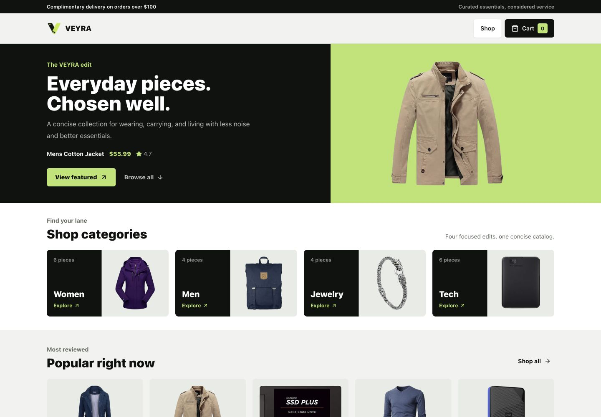
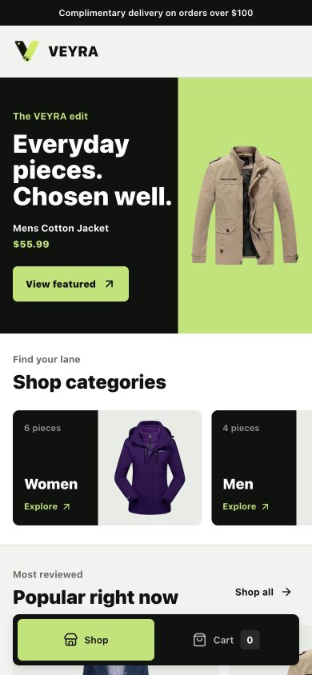
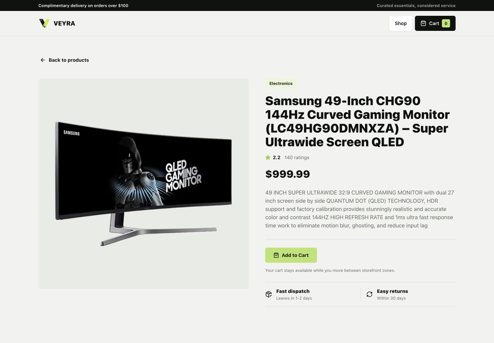
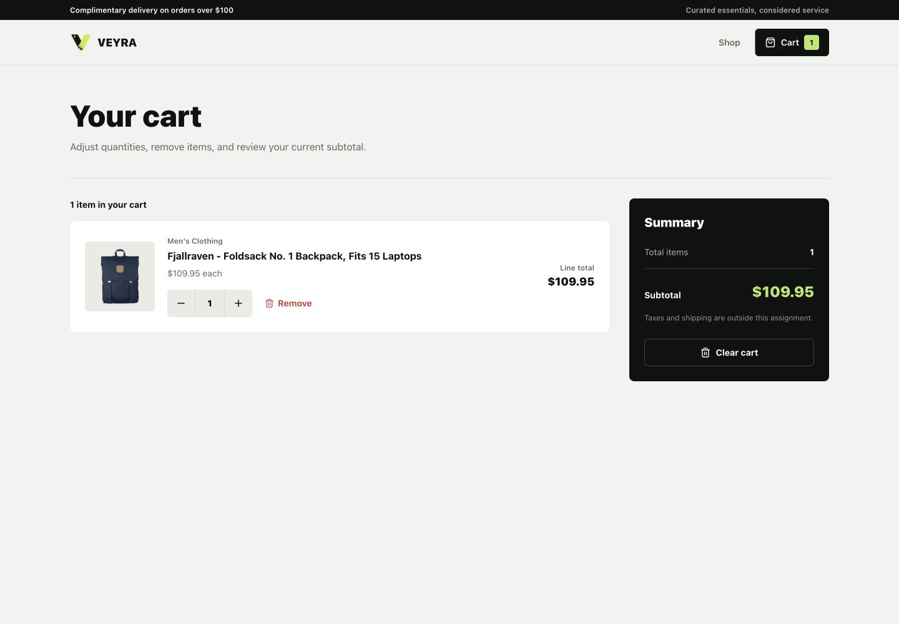
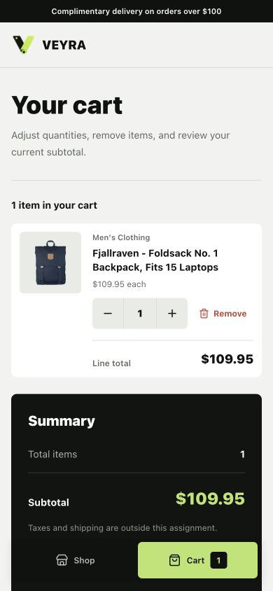
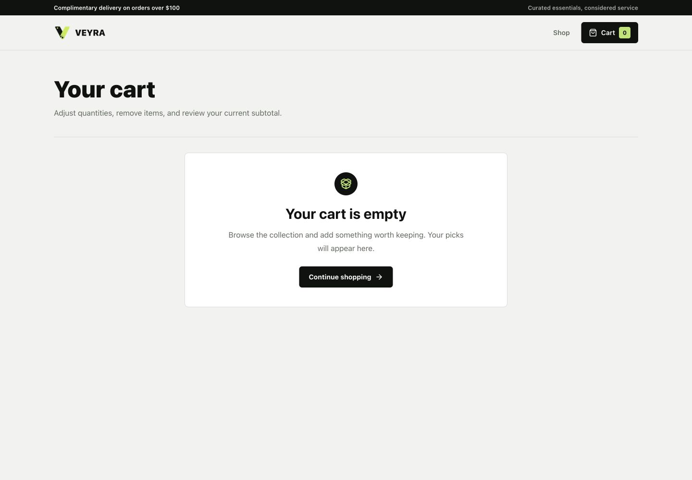

# VEYRA

VEYRA is a production-minded e-commerce take-home built as two independently
buildable Next.js applications. The home application owns product discovery and
detail routes. The cart application owns `/cart`. Next.js Multi-Zone routing
composes both applications behind the home origin so the experience still feels
like one storefront.

## Overview

- `apps/home` serves the catalog and product detail pages on port `3000`.
- `apps/cart` serves the cart zone on port `3002` with `basePath: "/cart"`.
- [Fake Store API](https://fakestoreapi.com/) provides product data.
- The home application rewrites `/cart/:path*` to the cart service.
- Shared packages provide UI primitives, product/cart types, and a
  framework-independent cart contract.

## Features

- Responsive product catalog with editorial, category, popular, and filtered
  product sections
- Server-rendered product listing and product detail pages
- Loading, API error, empty, and product-not-found states
- Optimized product images with stable responsive geometry
- Persistent cart quantities using a small versioned browser-storage contract
- Live cart counts, add, duplicate add, increment, decrement, remove, and clear
- Toast feedback and accessible keyboard/focus behavior
- Reduced-motion support
- Independently buildable applications and production Docker images

## Architecture

This repository is a pnpm workspace:

```text
apps/
  home/             Product listing and product detail zone
  cart/             Cart zone at /cart
packages/
  ui/               Shared presentation primitives and VEYRA theme tokens
  types/            Product, ProductId, and CartItem types
  cart-contract/    Browser-safe cart persistence and synchronization
tests/               Route, API, cart-contract, catalog, and UI contract tests
```

The applications share source packages but do not share a browser runtime.
Each app has its own Next.js configuration, build, standalone server, Dockerfile,
port, and healthcheck.

### Architecture Diagram

```mermaid
flowchart LR
  B[Browser on localhost:3000]
  H[Home application<br/>Next.js App Router<br/>port 3000]
  C[Cart application<br/>Next.js App Router<br/>port 3002]
  F[Fake Store API]
  CC[packages/cart-contract]
  LS[(localStorage<br/>kayra:cart:v1)]
  CE[CustomEvent<br/>same document]
  SE[storage event<br/>other tabs/documents]

  B -->|/, /products/:id| H
  B -->|/cart| H
  H -->|rewrite /cart/:path*<br/>to http://cart:3002/cart/:path*| C
  H -->|server fetch| F
  C -->|TanStack Query fetch| F
  H -. interactive cart UI .-> CC
  C -. interactive cart UI .-> CC
  CC -->|read/write CartItem[]| LS
  CC -->|dispatch after same-document write| CE
  LS -->|browser cross-document notification| SE
  CE --> CC
  SE --> CC
```

## Why Next.js Multi-Zone?

Multi-Zone preserves independent builds and deployment boundaries while
remaining compatible with the App Router. The home application owns the public
origin and delegates `/cart` to the independently running cart application.

Module Federation was not necessary for this scope. The zones do not need to
load each other's component bundles or share live React state. Explicit shared
packages and a hard navigation across the zone boundary provide a smaller,
clearer contract. Home-to-cart links therefore use normal anchors rather than
`next/link` client navigation.

The cart config sets `basePath: "/cart"`, while its root page remains
`apps/cart/app/page.tsx`. This composes exactly `/cart`; creating
`apps/cart/app/cart/page.tsx` would incorrectly risk `/cart/cart`.

## Data Fetching Strategy

Product listing and detail rendering stay server-first. `apps/home` uses a small
Fake Store API layer and Next.js server `fetch` with a 300-second revalidation
policy. The production route output marks `/` and `/products/[id]` as dynamic,
so product requests happen at runtime rather than during `next build`. Docker
image creation therefore does not require the Fake Store API to be reachable.

If the API is unavailable at runtime, home renders its route error state. An
invalid product parameter is rejected before the product streaming boundary and
returns HTTP 404. A missing product response renders the product not-found UI.

TanStack Query is intentionally not added to read-only home routes. They do not
need polling, optimistic updates, or client refetching, and keeping the fetch on
the server avoids adding that client state machinery to the catalog.

The cart is different: cart identity is read from browser storage after
hydration. Its narrowly scoped TanStack Query provider enriches those IDs from
the small Fake Store catalog, supports one retry, and exposes a clear retry UI.

## Cart Synchronization

The shared cart model stores only product identity and quantity:

```ts
type CartItem = {
  productId: number;
  quantity: number;
};
```

Product snapshots are not persisted, which avoids stale duplicated title,
image, and price data. `packages/cart-contract` validates unknown stored JSON,
normalizes duplicate IDs, ignores invalid quantities, and safely no-ops when
browser APIs are unavailable during server rendering.

Synchronization uses two browser channels:

- A versioned `CustomEvent` updates subscribers immediately after a write in
  the same document.
- The browser `storage` event updates subscribers in other documents or tabs on
  the same origin.

The intended flow is the composed experience at `http://localhost:3000`, where
`/cart` is rewritten to the cart service and both zones use the same browser
origin. Hard navigation still preserves `localStorage` state.

Opening home and cart directly at `localhost:3000` and `localhost:3002` creates
two different origins. Browser storage cannot synchronize between them. A real
production system would normally use a backend-owned cart for deployment-
independent, cross-device, authenticated persistence and server-authoritative
pricing and inventory.

## Server and Client Components

- Catalog and product detail pages are async Server Components.
- Shared `packages/ui` primitives remain server-compatible.
- Product cards and catalog presentation remain Server Components.
- Client boundaries are limited to Add to Cart actions, live cart counts,
  toast/motion behavior, and the interactive cart experience.
- Browser storage access is isolated behind `packages/cart-contract` and guarded
  from server execution.
- The cart QueryClient wraps only the cart experience, not the full layout.
- No `useEffect`-driven product fetching replaces home server rendering.

## Docker

Docker Compose runs two independent production services:

| Service | Host port | Internal address | Route |
| --- | ---: | --- | --- |
| home | `3000` | `http://home:3000` | `/`, `/products/*`, composed `/cart` |
| cart | `3002` | `http://cart:3002` | `/cart` |

Home is built with `CART_ORIGIN=http://cart:3002`, allowing Docker DNS to
resolve the cart service privately. Both multi-stage Dockerfiles install from
the frozen workspace lockfile, build one application, and copy only the Next.js
standalone output, `.next/static`, and that application's `public` assets into
the runner image. Containers run as the non-root `node` user.

Healthchecks use Node's built-in HTTP client:

- cart checks `http://127.0.0.1:3002/cart`
- home checks `http://127.0.0.1:3000/`
- home starts only after cart is healthy

`CART_ORIGIN` is build-time configuration because Next.js compiles rewrites into
the route manifest. Rebuild the home image after changing it.

## Getting Started

Prerequisites: Node.js 22+, Corepack, and pnpm 9.12.2.

```bash
corepack enable
corepack prepare pnpm@9.12.2 --activate
pnpm install --frozen-lockfile
```

Start both development applications:

```bash
pnpm dev
```

Open `http://localhost:3000` and use `http://localhost:3000/cart` for the
composed same-origin cart flow.

Start applications individually when service-level work is needed:

```bash
pnpm dev:home
pnpm dev:cart
```

Run project checks:

```bash
pnpm test
pnpm lint
pnpm typecheck
pnpm build
```

Independent production builds:

```bash
pnpm --filter @kayra/home build
pnpm --filter @kayra/cart build
```

## Docker Usage

```bash
docker compose build
docker compose up -d
docker compose ps
docker compose logs home cart
```

Open the composed production experience at `http://localhost:3000`. Direct cart
service verification is available at `http://localhost:3002/cart`, with the
cross-origin storage limitation described above.

Stop and remove the environment:

```bash
docker compose down --remove-orphans
```

For a fully cold image verification:

```bash
docker compose build --no-cache
```

## Testing

The committed suite uses the Node test runner and TypeScript compilation. It
covers:

- Multi-Zone `basePath`, rewrite, standalone, and hard-navigation contracts
- Fake Store API request, cache, invalid-ID, missing-data, and error behavior
- Cart storage normalization and browser API guards
- Same-document `CustomEvent` and cross-document `storage` subscriptions
- Add, update, remove, clear, count, persistence, and cart-line calculations
- Catalog filtering, featured selection, and popular ranking
- Focused UI/accessibility contracts, loading geometry, image priority, and
  Docker public-asset packaging

Production browser and Docker flows are manually verified during submission
hardening. The repository does not claim a committed full end-to-end browser
suite.

## Trade-Offs and Limitations

- Cart persistence is intentionally task-level `localStorage`, not a production
  cart service.
- Direct ports `3000` and `3002` are separate origins and cannot share storage.
- Runtime product content depends on Fake Store API availability.
- There is no checkout backend, authentication, inventory reservation, payment,
  or order creation.
- Pricing and product availability are not server-authoritative cart data.
- The UI does not present controls for functionality that is not implemented.
- CI/CD is intentionally outside this take-home's final scope; deterministic
  local and Docker verification commands are documented instead.

## Future Production Improvements

- Backend-owned cart with user/session persistence
- Batched cart enrichment with authoritative price and inventory validation
- Authentication and cross-device cart recovery
- Structured logs, metrics, tracing, and error monitoring
- Deployment routing for independently released zones
- A fuller browser end-to-end suite in CI

## Screenshots

All selected screenshots were captured from the production Docker Compose
environment. Generated Playwright output remains ignored; only these submission
assets are committed intentionally.

| Desktop listing | Mobile listing |
| --- | --- |
|  |  |

| Product detail | Desktop cart |
| --- | --- |
|  |  |

| Mobile cart | Empty cart |
| --- | --- |
|  |  |
